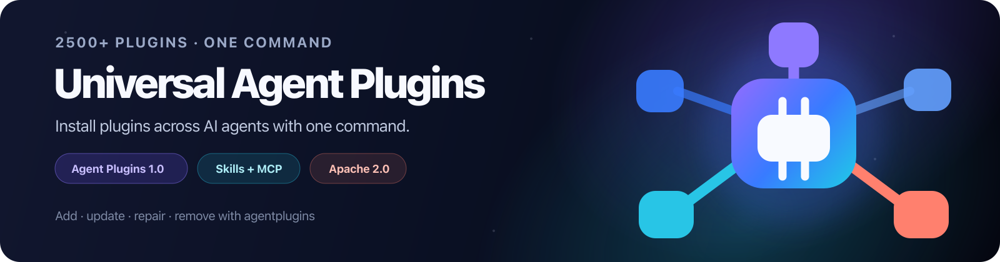

# Universal Agent Plugins Registry

The community directory for [Agent Plugins 1.0](https://agent-plugins.org/specification).
Browse portable packages, review their source and compatibility notes, then
install one with the Universal Agent Plugins CLI.

## Browse and install

[Open the directory](https://777genius.github.io/universal-agent-plugins-registry/)
to search reviewed packages and the public Discovery index.

```bash
npx universal-agent-plugins search docs
npx universal-agent-plugins add context7 --target codex,cursor
npx universal-agent-plugins add context7 --target codex,cursor,kiro
npx universal-agent-plugins update context7 --target codex,cursor
npx universal-agent-plugins repair context7 --target codex,cursor
npx universal-agent-plugins switch context7 --to 777genius/context7
npx universal-agent-plugins remove context7 --target codex,cursor
npx universal-agent-plugins add cloudflare-docs --target codex,cursor,kiro
npx universal-agent-plugins switch cloudflare-docs --to 777genius/cloudflare-docs
```

The CLI is the product that installs, updates, repairs, and removes packages
across supported agents. It downloads a package once, validates it, and prepares
the format each selected client understands. Targets are explicit: one command
can name several agents, but it never changes every detected client silently.

[Universal Agent Plugins CLI](https://github.com/777genius/universal-agent-plugins)

The CLI repository is the product home and npm facade source. Its facade installs the `agentplugins` binary; `plugin-kit-ai` remains the shared Go implementation engine during the staged rename, and the engine is not duplicated in this registry.

`universal-agent-plugins` is the npm package; `agentplugins` is the installed
command. The CLI's `upstream`, `community bridge`, `community`, and `direct source`
labels describe where a package came from. A catalog entry is not official vendor
software, and it is not an official vendor package. A `materialized or installed package does not by
itself prove` that its service, OAuth flow, or runtime tool call works.

## Supported clients

|  |  |  |
| --- | --- | --- |
|  Codex |  ChatGPT |  Cursor |
|  GitHub Copilot CLI |  VS Code |  Kiro |

These are CLI targets, not a promise that every package works in every client.
Compatibility is package-specific and any remaining activation or OAuth step is
shown by the CLI.

## What is in this directory?

- **Reviewed packages** are maintained entries with visible source, components,
  permissions, and compatibility status.
- **Discovery** contains automatically indexed public GitHub package paths. They
  are useful to explore, but are not endorsements or runtime guarantees.
- **Community bridges** package a pinned upstream commit while an upstream
  contribution is being reviewed. The source label is always shown.

The catalog currently contains 26 reviewed packages and 2,500+ discovered
package paths. Counts can change as signed snapshots are published. A schema
pass does not prove activation, OAuth, or a successful tool call in every agent.

All 26 packages pass standard schema validation. Historical evidence includes
15/15 runtime checks for five starter packages across Codex, Cursor, and Kiro.
Installation coverage is broader than runtime coverage; see the test matrix and
verification report for exact boundaries.

Evidence is intentionally separated: runtime-tested, OAuth-tested, read-only,
and not-proven are different claims. Figma OAuth was tested separately in Codex
only. ChatGPT and Copilot claims are narrower and follow the client-specific
activation steps shown in the matrix.

The CLI is not limited to this Directory. External packages do not need to be copied into it. Use a local package or a pinned GitHub source:

```bash
npx universal-agent-plugins add ./my-plugin --target cursor
SOURCE=owner/repository@0123456789abcdef0123456789abcdef01234567//path/to/plugin
npx universal-agent-plugins add "$SOURCE" --target cursor
```

## Submit a package

Contributors can propose an Agent Plugins 1.0 package through a fork and pull
request. Start with [CONTRIBUTING.md](CONTRIBUTING.md). The checks validate
`plugin.json`, package contents, source pins, permissions, and the registry
policy before a maintainer reviews the change.

Submissions are ordinary GitHub pull requests. No account credentials or
service tokens belong in a package. Never put OAuth secrets in `plugin.json`,
`mcp.json`, or committed headers.

## Trust and compatibility

Read the package's components and permissions before enabling it. Directory
status, schema validation, installation preparation, runtime evidence, and OAuth
evidence are separate signals. See the [test matrix](docs/TEST_MATRIX.md),
[verification report](docs/VERIFICATION.md), and
[compatibility guide](docs/COMPATIBILITY.md) for exact boundaries.

This registry is an independent community project. It is not affiliated with
OpenAI, Agent Plugins, or the vendors shown in the catalog.

## License

Registry code and first-party catalog metadata are Apache 2.0. Third-party
packages, logos, and notices keep their original licenses; see each package's
`NOTICE` and source link.
